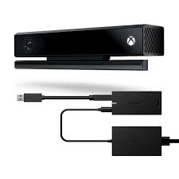
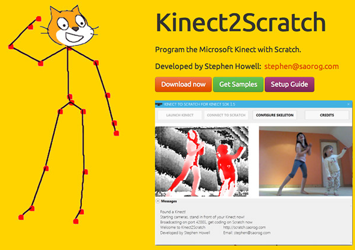
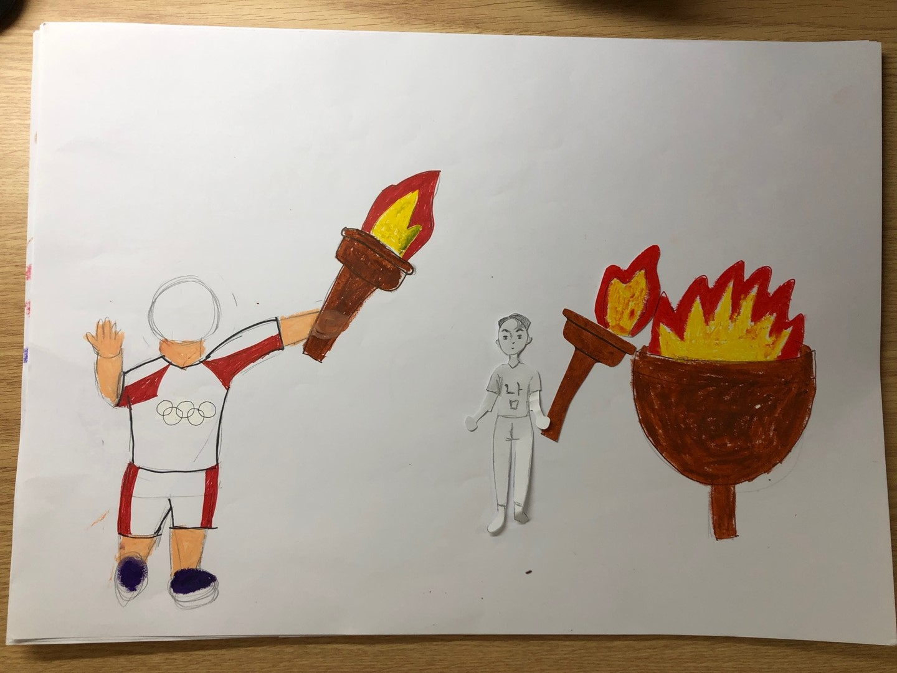
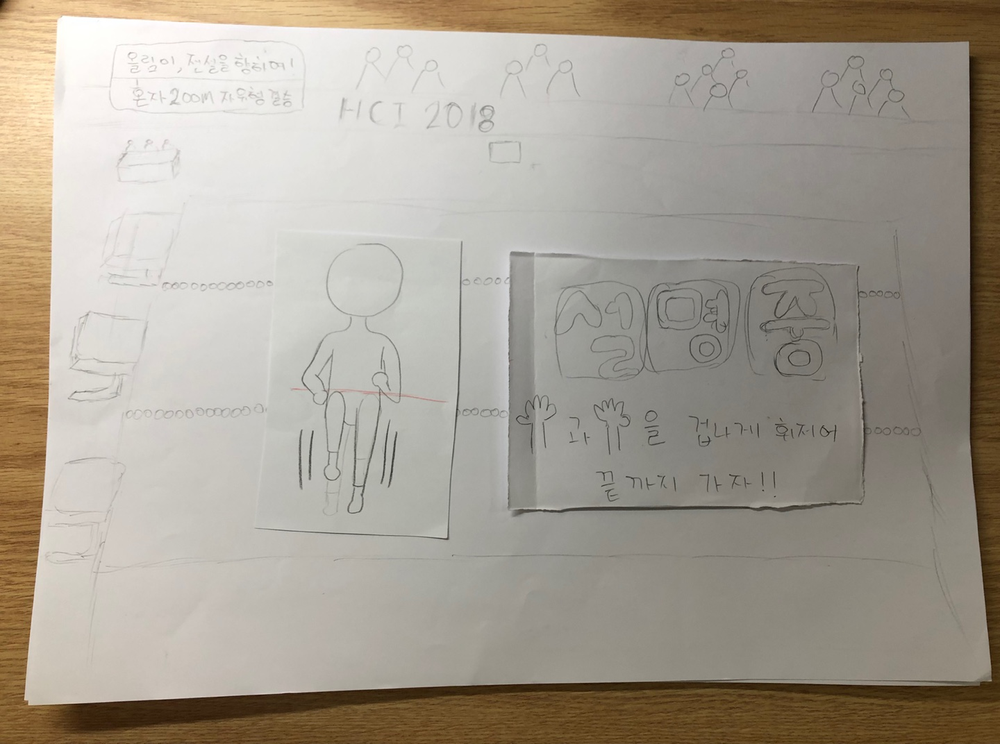
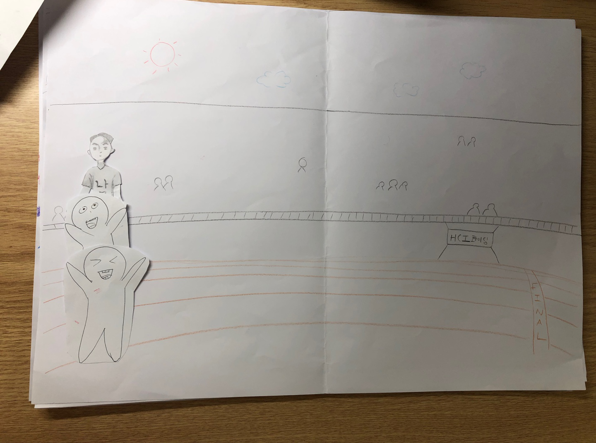
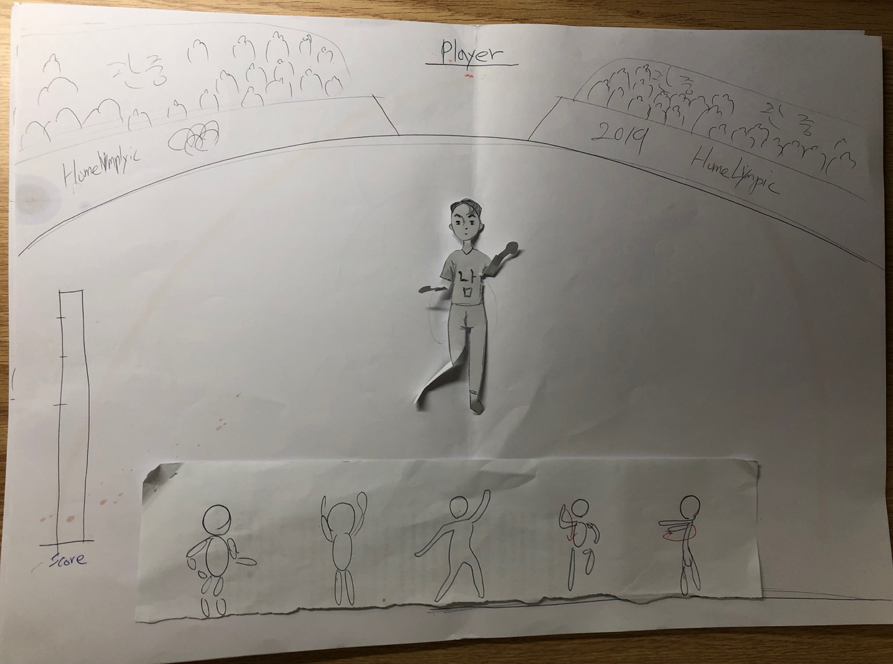
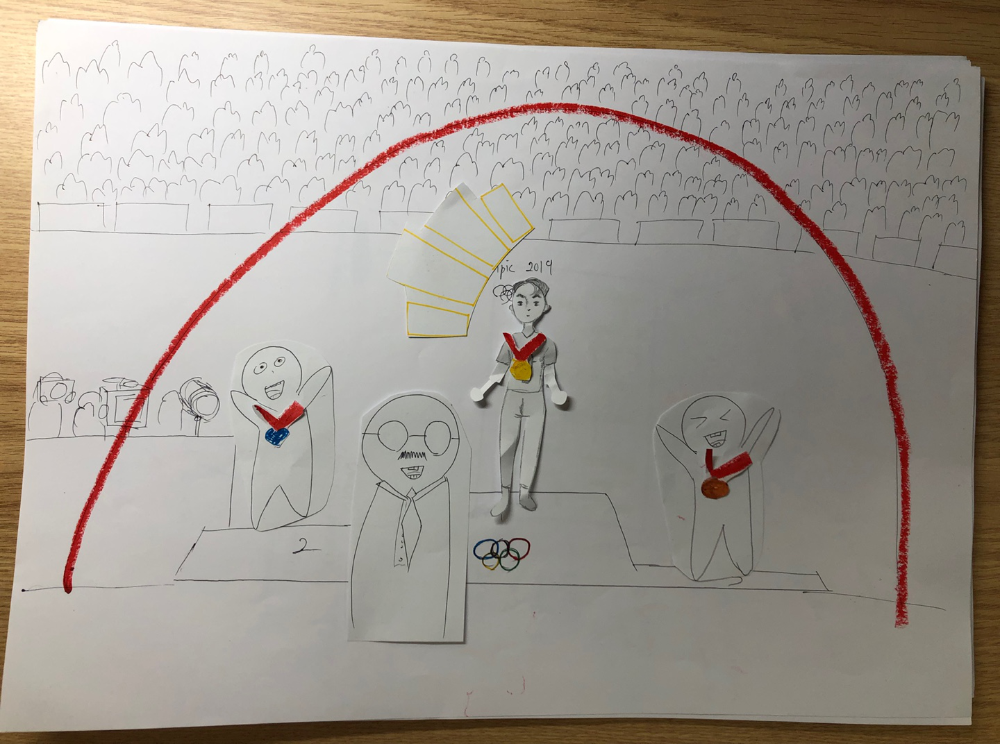

# Homelympic

#### Members
- 변지혜, 이동희, 정진호, 최현종
#### Agenda
- ScratchX를 이용한 Kinect 게임 제작

   

## 주제. 집에서 즐길 수 있는 올림픽 게임
### 아이디어 선정 과정
Idea: Using the Kinect that can be used throughout the body, we are going to enhance the reality of Olympic Games and allow users to gain new and special experiences. 

-Target: We are going to provide ‘Olympics’ game to the people who don’t want to go out of their house, but want to do something active and who are not familiar with Kinect.

-Purpose and Expectation: The user can experience various activity (sports game) at home, and they can have a special experience.

### 주요 내용
#### 시작 화면
시작하는 과정을 올림픽과 유사하게 만들어 올림픽을 경험하는 느낌을 주었다.
1. 올림픽 문양과 유사한 디자인의 Homelympic 문구가 나온다
2. 손으로 성화를 옮겨 성화봉송대에 옮기면 불이 붙고 게임이 시작된다
3. 손의 x,y 좌표를 움직여 캐릭터 선택(남,여)를 한다

![화면1] [화면2]

####  종목 1 : 권투
링 안에서 상대방 랜덤으로 나타다는 상대방 선수를 사용자가 주먹으로 때리는 것으로 설정하였다.
1. 게임 방식 설명: 진행될 게임의 방식을 설명한다
2. 상대방의 x,y 좌표를 1초 간격으로 화면 이미지에 맞게 랜덤으로 설정한다
3. 상대가 맞을 때 마다 게임적인 흥미 요소를 추가시키기 위해 이펙트를 추가
4. 상대방의 이미지에 글러브에 닿으면 점수가 올라간다
5. 점수에 따라서 메달 수여

#### 종목 2 : 달리기
다리를 허리 위로 움직일 때마다 캐릭터가 앞으로 조금씩 움직이게 설정했다.
1. 게임 방식 설명: 진행될 게임의 방식을 설명한다
2. 무릎의 x,y 좌표를 번갈아 가면서 허리 좌표 위로 올렸을 때 캐릭터가 움직인다
3. 다른 경쟁자들의 움직임은 랜덤으로 설정한다
4. 캐릭터가 통과선 안으로 들어오는 순서대로 순위가 매겨진다
5. 순위에 따라서 메달 수여

#### 종목 3 : 수영
특정 좌표를 화면 안에 지정하고 왼손과 오른손이 그 범위 안에 들어왔을 때 캐릭터를 앞으로 움직이게 설정
1. 게임 방식 설명: 진행될 게임의 방식을 설명한다
2. 왼손과 오른손을 움직여 특정 좌표안에 위치시키면 캐릭터가 움직인다 좌표가 위 아래로 변경된다
3. 다른 경쟁자들의 움직임은 랜덤으로 설정한다
4. 캐릭터가 통과선 안으로 들어오는 순서대로 순위가 매겨진다
5. 순위에 따라서 메달 수여

#### 종목 4 : 리듬체조
4가지 동작의 좌표를 각각 다르게 설정하고 사용자가 그 좌표에 맞게 몸을 움직이면 통과
1. 게임 방식 설명: 진행될 게임의 방식을 설명한다
2. 온 몸을 움직여 화면 하단에 나오는 동작의 모습과 비슷하게 동작을 취하면 통과한다.
3. 성공한 횟숭 따라서 점수가 부여된다
4. 순위에 따라서 메달 수여

#### Ending
게임을 모두 마쳤을 때, 4개의 게임에서 받았던 메달에 점수를 부여(금:3, 은:2, 동:1, 무:0)하여 등수를 선정하고, 등수에 따라서 시상식에 캐릭터가 올라가 상을 수여받도록 한다. 

### 구현 원리

### 장점

### 한계

### Source Code

### Reference

